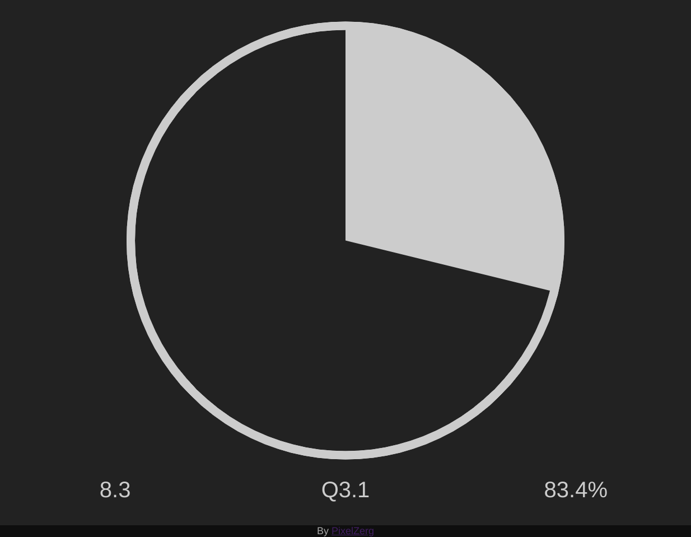

# IntervalTimer
A simple interval timer. For exercising, studying, whatever

I made this for myself so it isn't user-friendly. To use it, you must open up the developer console and execute some JavaScript:<br>
E.g: To help for exam timing:<br>

1) Set up the number of marks in each question

Either:
```js
marks = [3, 4, 1, 2]; // as required
```
or (if all questions are equal amounts of marks):
```js
equalMarks(numMarks, numQuestions);
```

2) Set the amount of time (in seconds) per mark

```js
int = 75*60/20; // e.g: a 75min exam with 20 marks
```

3) start the timer
```js
start();
```

---
The timer will beep every interval as defined, with a visual indicator too.<br>
interval count, question number, percentage of exam complete will also be displayed (in that order)

When the exam has finished (percentage > 100%), there will be a constant ringing sound. The timer however, will continue tracking excess time.

